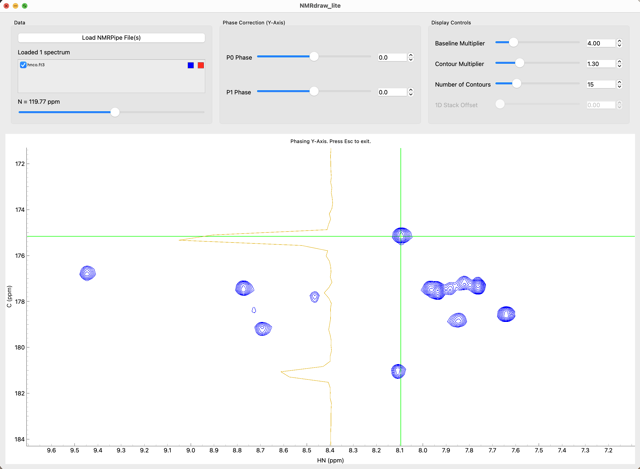

# NMRdraw_lite


### A fast, lightweight Python utility for viewing NMR data processed with NMRpipe. 


## Installation

```
pip install -r requirements.txt 

python main.py [file1.ft file2.ft ...]
```

## Example Data
The `example/` directory contains sample datasets from my laboratory.
 

## Standalone MacOS App
Look in the **Releases** directory for standalone apps for [**Apple Silicon**](https://github.com/21tesla/NMRdraw_lite/releases/download/1.0_arm64/NMRdraw_lite_arm64.dmg) Macs.

## Acknowledgements
Thank you to **Dr. Frank Delagio** (IBBR / U Maryland) for the original NMRdraw that has been used for decades and **Dr. Johnthan Helmus** (www.nmrglue.com) for the nmrglue framework that powers all the visualization and reads NMR data formats. 

## Features
**1D Spectra:** stack plots with variable offsets


**2D Spectra:** quick visualization of titrations


**3D Spectra:** fast scrolling through planes


