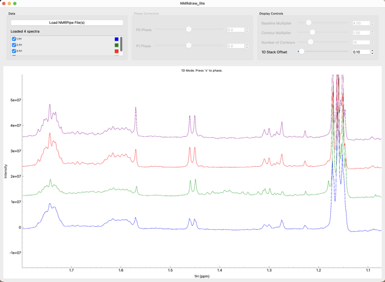
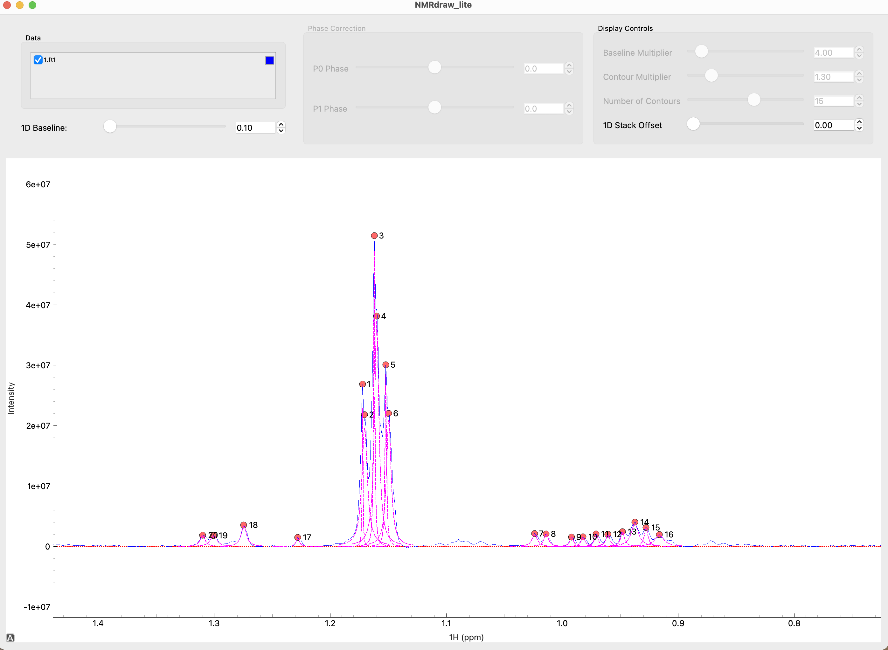
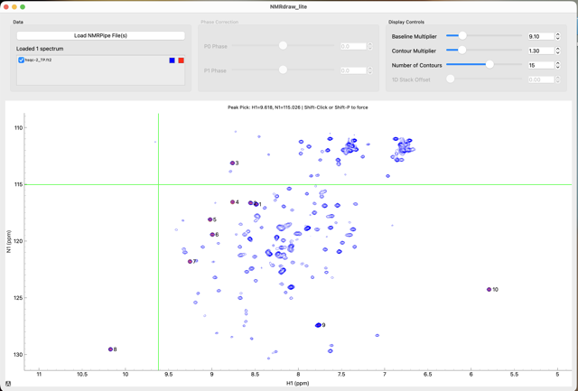
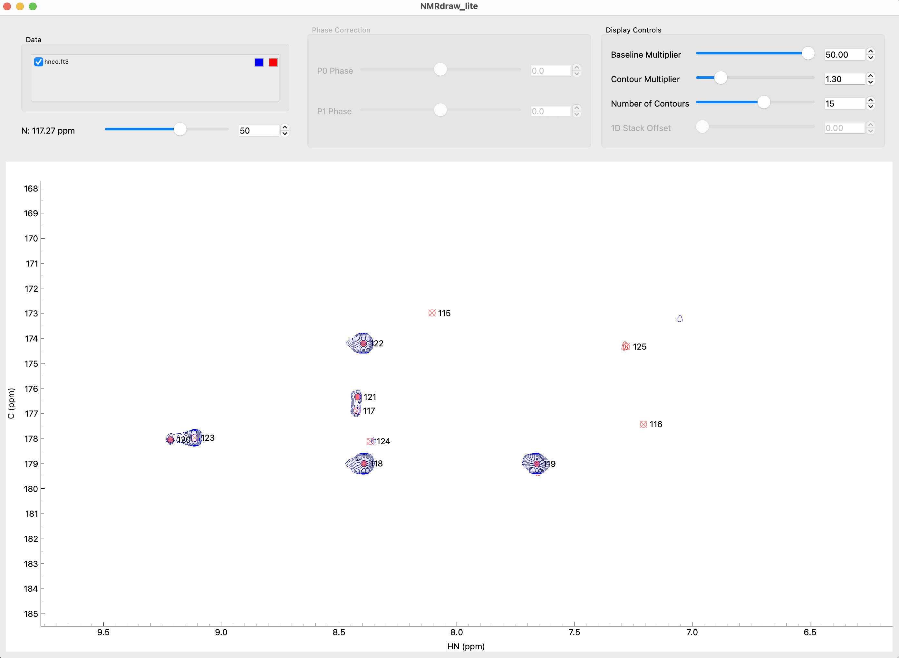
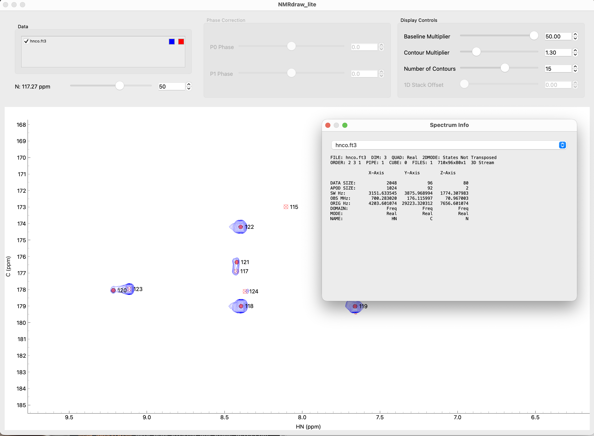

# ndlite


### A Python utility for viewing and peak picking NMR data processed with NMRpipe. 


## Installation

```
pip install -e . 

ndlite [file1.ft file2.ft ...]
```

## Example Data
The `example/` directory contains sample datasets from my laboratory.
 

## Standalone MacOS App
Look in the **Releases** directory for standalone apps for both Intel and Apple Silicon computers.

## Acknowledgements
Thank you to **Dr. Frank Delagio** (IBBR / U Maryland) for the original NMRdraw that has been used for decades and **Dr. Johnthan Helmus** (www.nmrglue.com) for the nmrglue framework that powers all the visualization and reads NMR data formats. 

## Features
**1D Spectra:** stack plots with variable offsets


**1D Spectra:** peak picking


**2D Spectra:** auto and manual peak picking


**3D Spectra:** dynamic phasing in x,y,z 


**3D Spectra:** auto peak picking and plane detection


**file info:** NMRpipe "showhdr" style file information



